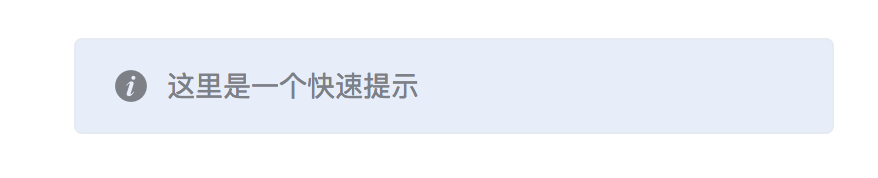

# Dialog窗口使用文档
作为常用的一个组件，Dialog的实用方式还是很简单的。有常用Dialog.create方式，生成一个完成的dialog实例；也可以使用快捷的功能函数alert\confirm\prompt；也有快速的提示qtip。

#### Dialog.qtip(msg[, type[, config]])
在页面顶部显示一个快速的tip，类似于toast。

qtip有多态形式
```javascript
Dialog.qtip(msg[, type[, config]]);
Dialog.qtip(msg[, config]);
Dialog.qtip(config);
```
[查看demo](http://localhost:3000/demo?demo=dialog)

_参数_：
* msg
	* 类型：`String`
	* 详情：消息文字
* type
	* 类型：String
	* 详情：颜色类型，可选值有 success/warning/info/error
* config
	* 类型：Object
	* 详情：config下所有可配置的参数：
		* message，String，会重写msg参数
		* type, String，会重写type参数
		* duration，Number，显示时间，毫秒。默认为3000。

#### Dialog.alert(msg[, title[, config]])
显示一个带消息的警告框。

使用方法：
```javascript
Dialog.alert('这是一个提示');
Dialog.alert('这是一个提示', '提示');
Dialog.alert('这是一个提示', {
	fn(){
		alert('这里是关闭提示时，做的一些动作');
	}
});
Dialog.alert('这是一个提示', '提示', {
	fn(){
		alert('这里是关闭提示时，做的一些动作');
	}
});
```
_参数_：
* msg
	* 类型：String
	* 详情：消息文本
* title
	* 类型：String
	* 详情：对话框的标题
* config
	* 类型：Object
	*  详情：config下所有可配置的参数：
		* message，String，会重写msg参数
		* title, String，会重写type参数
		* fn，Function，关闭对话框时触发的函数

#### Dialog.confirm(msg[, title[, config]])
显示一个带有指定消息和 OK 及取消按钮的对话框。

使用方法：
```javascript
Dialog.confirm('这是一个提示');
Dialog.confirm('这是一个提示', '提示');
Dialog.confirm('这是一个提示', {
	fn(ret){
		if(ret=='yes')
			alert('您选择了确定按钮');
		else
			alert('您选择了关闭或者取消按钮')
	}
});
```

_参数_：
* msg
	* 类型：String
	* 详情：消息文本
* title
	* 类型：String
	* 详情：对话框的标题
* config
	* 类型：Object
	*  详情：config下所有可配置的参数：
		* message，String，会重写msg参数
		* title, String，会重写type参数
		* fn，Function，关闭对话框或者点击按钮时触发的函数，参数有：
			* ret，String，为'yes'时表明点击了“确定”按钮；为“no”时表明点击了“取消”或“关闭”按钮

#### Dialog.prompt(msg[, title[, config]])
显示可提示用户进行输入的对话框。

使用方法：
```javascript
Dialog.confirm('需要您输入内容', {
	fn(ret){
		alert('您输入的内容是：'+ret);
	}
});
```

_参数_：
* msg
	* 类型：String
	* 详情：消息文本
* title
	* 类型：String
	* 详情：对话框的标题
* config
	* 类型：Object
	*  详情：config下所有可配置的参数：
		* message，String，会重写msg参数
		* title, String，会重写type参数
		* fn，Function，关闭对话框或者点击按钮时触发的函数，参数有：
			* ret，String，用户输入的内容

#### Dialog.create(config)
标准的窗口组件，通过config参数来配置不同的窗口。config的参数有：
`注意，上面的qtip和对话框都不是真正的窗口组件，只是挂在Dialog下的快捷使用入口`

* title
	* 类型：String
	* 默认值：''
	* 详细：窗口的标题
* bodyCls
	* 类型：String
	* 默认值：null
	* 详细：应用在窗口元素的样式名
* bodyStyle
	* 类型：Object
	* 详细：应用在窗口元素上的样式
* contentEl
	* 类型：dom元素
	* 详细：窗口内的元素
* html
	* 类型：String
	* 详细：窗口内的元素。注意，contentEl和html都是指定窗口内展示的内容，不过contentEl是dom元素，可以是页面中已存在的，也可以是通过document.creatElement创建的；html是html代码字符串
* width
	* 类型：Number/String
	* 默认值：640
	* 详细：窗口的宽度。可以是具体的数值，也是可以百分比，如'80%'
* height
	* 类型：Number/String
	* 默认值：480
	* 详细：窗口的高度。可以是具体的数值，也是可以百分比，如'80%'
* autoShow
	* 类型：Boolean
	* 默认值：true
	* 详细：窗口创建好之后，是不是立即显示出来。如果为false，就需要程序在合适时机调用show方法显示出来
* closable
	* 类型：Boolean
	* 默认值：true
	* 详细：在标题区域显示一个关闭按钮。注意，这个参数并不是限制窗口关闭不了，只是不显示右上角的关闭按钮
* modal
	* 类型：Boolean
	* 默认值：true
	* 详细：窗口是不是模态的。模态窗口会显示一个遮罩层，遮罩使页面中除了窗口，其它地方都不可点击
* closeAction
	* 类型：String
	* 默认值：'destroy'
	* 详细：关闭窗口时执行的动作。
		* 'destroy'，关闭窗口后直接销毁它
		* 'close'，关闭窗口后元素不销毁，可以再次通过show方法显示出来
* listeners
	* 类型：Object
	* 详细：窗口支持的事件
		* ready，窗口dom元素创建之后触发
		* beforeshow，窗口show动作执行前触发
		* beforehide，窗口隐藏前触发。注意hide命令只隐藏窗口，不销毁它
		* beforeclose，窗口关闭动作执行前触发
		* close，窗口关闭后触发
		* destroy，窗口销毁后触发
* buttons
	* 类型：Array
	* 详细：buttons中的每一项是一个按钮的配置
	* 参考：
		* [按钮配置](config.md#button-config)

# Dialog的实例方法
通过Dialog.create方法创建的Dialog实例，有一些方法，控制窗口的行为。
* show()，使窗口显示出来
* hide()，隐藏窗口，并且不销毁dom
* close()，隐藏窗口，然后根据closeAction决定是否要销毁窗口dom

# Dialog与Vue的配合使用
使用Dialog时，经常涉及到对窗口中的内容做一些处理，获取表单的内容等。为了方便处理，dialog支持做为一个vue实例使用。config参数中，除了上面说明的参数外，还支持vue的所有配置参数，它些配置参数，用于对窗口内的html生成一个vue实例。
```html
<script type="text/html" id="tmpl">
	<form id="testForm" @submit.prevent="submit">
		<table>
			<tr>
				<td>电影名</td>
				<td>
					<input name="movieName" v-model="movie.name" />
				</td>
			</tr>
			<tr>
				<td>发行时间</td>
				<td>
					<select name="year" v-model="movie.year">
						<option value="2017">2017</option>
						<option value="2018">2018</option>
						<option value="2019">2019</option>
					</select>
				</td>
			</tr>
		</table>
	</form>
</script>
```
```javascript
let dia = Dialog.create({
	title: '一个带vue的示例',
	width: '60%',
	height: '60%',
	buttons:[{
		text: '提交',
		nativeType: 'submit',
		form: 'testForm'
	}],
	html: document.getElementById('tmpl').innerHTML,
	//以下为vue的配置
	data: {
		movie: {
			name: '豌豆公主第一季',
			year: '2018'
		}
	},
	methods: {
		submit(){
			Dialog.alert('结果是：'+JSON.stringify(this.movie));
		}
	}
});
```
上面例子中，dialog内是一个vue实例，它展示了一个demo，当点击提交按钮时，直接通过this.movie拿到form表单的数据，可以进行处理了。

> 注意，这里有一个小技巧，我们给提交按钮指了一个form属性和一个nativeType为'submit'的属性。这就让它成了表单testForm的提交按钮，点击它直接触发表单testForm的submit事件。